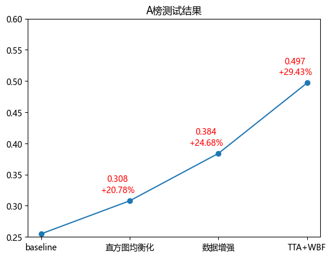

# Road-Defect-Detection
Road Defect Detection Based on Yolov8

## 第五届全球校园人工智能算法精英大赛 — 道路病害目标检测挑战赛

[【赛题详情】算法挑战赛：道路病害目标检测比赛规则](https://www.saikr.com/c/nd/15206)

### 任务要求

1.利用训练数据构建算法模型检测出图片中横向裂缝、纵向裂缝、块状裂缝、龟裂、坑槽、修补网状裂缝、修补裂缝、修补坑槽的目标。

2.构建算法模型的docker镜像并提供容器运行说明手册，要求说明算法程序如何读取输入图像数据生成预测文件。

### 训练数据简介

2000张使用txt文件标注图片，标注文件和图片文件文件名一一对应，仅文件名不同后缀，类别编号为：横向裂缝 0、纵向裂缝 1、块状裂缝 2、龟裂 3 、坑槽 4、修补网状裂缝 5、修补裂缝 6、修补坑槽 7。

### 图片数据示例

标注数据示例及说明：一个标注文件中会存在大于等于1行的标注信息，如下图所示，信息由空格分分格，各位置字段含义分别为：目标类别，x_center, y_center, w, h，其中x_center, y_center表示目标中心点坐标占图片长和高的比例；w, h表示目标长和高占图片的比例。

## 问题难点

- 数据标注质量低：数据中存在横、纵裂缝标签冲突；
- 数据分布长尾效应：数据各标签分布不均衡，横、纵裂缝较多，而修补裂缝较少；
- 图像质量低：存在因天气影响，导致图片数据过暗/过曝；
- 小目标检测较多，易被忽略或错检。

## 解决方法

- 数据重标；
- 数据增强、数据扩充；
- 直方图均衡化处理：过暗和过亮的图像经过直方图均衡化，使得图像变得清晰；
- 采用多尺度训练和测试方法，使用特定的小目标检测网络结构，提升小目标检测的效果。

## Trained models

[`yolov8s-rong.pt`](https://github.com/LiaoKyle/Road-Defect-Detection/releases/download/YOLOv8-rdd/yolov8s_rong.pt)

[`yolov8n-yuan.pt`](https://github.com/LiaoKyle/Road-Defect-Detection/releases/download/YOLOv8-rdd/yolov8n_yuan.pt)

[`yolov8x-rong.pt`](https://github.com/LiaoKyle/Road-Defect-Detection/releases/download/YOLOv8-rdd/yolov8x_rong.pt)

## 最终结果

### A榜：0.497 &nbsp;&nbsp;&nbsp; B榜：0.304 &nbsp;&nbsp;&nbsp; rank：20。

## 致谢
[include233](https://github.com/include233)

## 
License

YOLOv8 is available under two different licenses:

- **GPL-3.0 License**: See [LICENSE](https://github.com/ultralytics/ultralytics/blob/main/LICENSE) file for details.
- **Enterprise License**: Provides greater flexibility for commercial product development without the open-source
  requirements of GPL-3.0. Typical use cases are embedding Ultralytics software and AI models in commercial products and
  applications. Request an Enterprise License at [Ultralytics Licensing](https://ultralytics.com/license).

